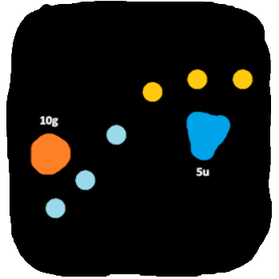
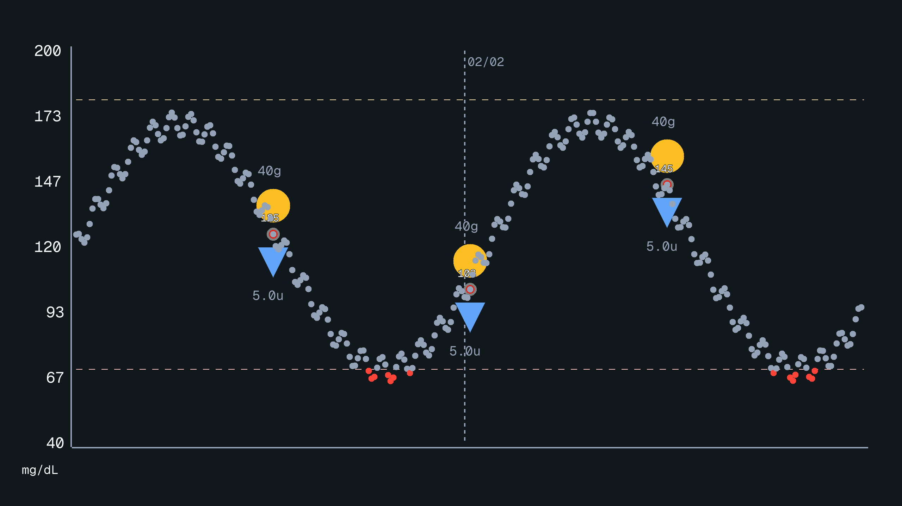
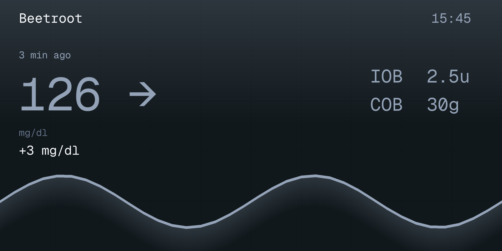
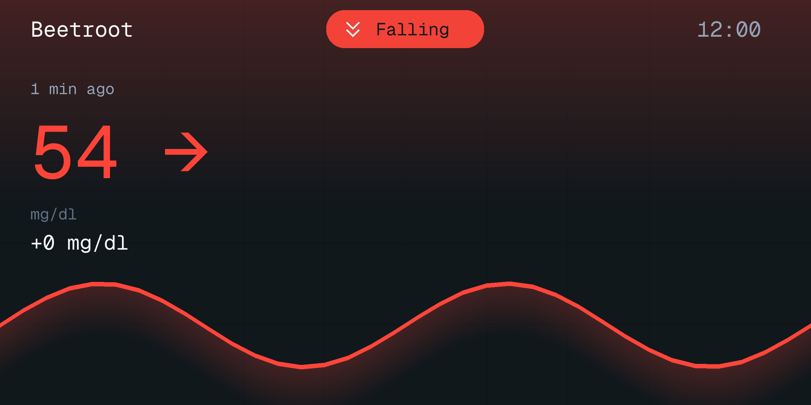
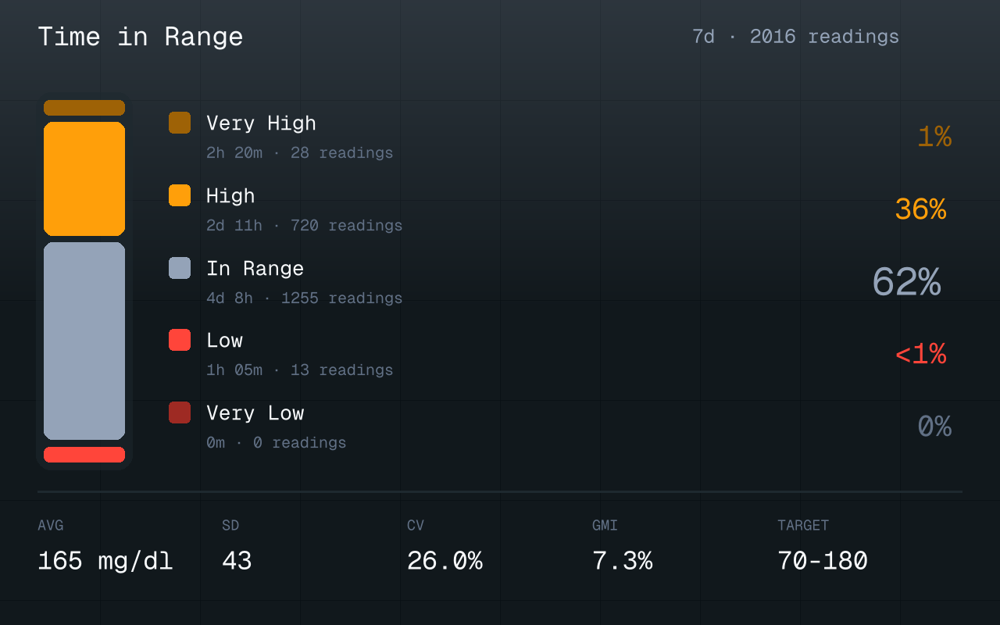

<p align="center">
  
</p>

<h1 align="center">Bonbon</h1>

<p align="center">
A sweet and simple Rust library for generating static diabetes data visualizations.
</p>

---

## Overview

Bonbon is a fast, customizable graph rendering library designed for diabetes related data visualization. It supports glucose entries, insulin doses, carbohydrate intake, and manual blood glucose readings with configurable themes, units, and layout options.

## Features

- **Flexible Units**: Support for mg/dL, mmol/L, or dual-unit display
- **Treatment Visualization**: Insulin boluses, carbohydrate entries, and manual BG readings
- **Customizable Themes**: 6 built-in themes. (See `Theme::builtins()`) with full customization support
- **Dynamic Scaling**: Automatic Y-axis scaling based on glucose values
- **Timezone Support**: Accurate time axis labels for any timezone
- **Microbolus Filtering**: Configurable threshold to simplify SMB visualization
- **BG Card**: Compact status card showing current glucose, trend, delta, IOB/COB, and a 3 hour sparkline
- **Time in Range Card**: TIR summary with a stacked band bar, per-band durations and counts, plus average, SD, CV and GMI statistics

---

## Glucose Graph

The Glucose Graph is a full-resolution chart rendering glucose entries over time, with optional treatment markers (insulin boluses, carbs, manual BG readings), configurable Y-axis scaling, timezone-aware time axis, and dual-unit support.

<p align="center">
  
</p>


---

## BG Card

The BG Card is a compact 640×320 status card (scalable via `with_scale`) that renders current glucose, trend arrow, delta, age, IOB/COB, and a color-coded 3-hour sparkline with an ambient gradient fill.

<p align="center">
  
  
</p>


---

## Time in Range Card

The Time in Range Card is a 640×400 summary (scalable via `with_scale`) of how much time was spent in each glycemic band (very low, low, in range, high, very high) rendered as a stacked bar with per-band percentages, durations and reading counts, and a statistics footer (average, SD, CV, GMI, target range). Band thresholds, units, theme and the 3-band/5-band layout are configurable, and the computed numbers are available without rendering through `TirStats::compute`.

<p align="center">
  
</p>

---

## Installation

Add Bonbon to your `Cargo.toml`:

```toml
[dependencies]
bonbon = "0.4.1"
```
## Examples & Docs
Some usage examples can be found in the `bonbon/examples` directory.

Additional documentation can be found on the `docs.rs` website.

## Performance Tips

To achieve the best possible rendering speed, it is highly recommended to compile with **native CPU optimizations**. This enables modern SIMD instructions (AVX2, NEON, etc.), which accelerates the pixel blending and sprite rendering operations.

You can enable this by setting the `RUSTFLAGS` environment variable:

```bash
RUSTFLAGS="-C target-cpu=native" cargo build --release
```

Or by adding a `.cargo/config.toml` to your project:

```TOML
[build]
rustflags = ["-C", "target-cpu=native"]
```

## Benchmarks

### BG Card build time at 4× scale (2560×1280)
Averaged across 8 rendering scenarios (InRange, High, Low, multi-status, mmol/L, flat sparkline, single point, no sparkline).

| Hardware | Avg. build time |
| --- | --- |
| **Ryzen 5 9600x** | ~25.3ms |

### Graph build time (using native CPU compilation optimizations)
| Benchmark Test | Resolution | Entries | Ryzen 5 9600x | Quad-core ARM Cortex-A72 |
| --- | --- | --- | --- | --- |
| **Standard FHD** | 1920x1080 | 288 | 2.26ms | 21.15ms |
| **QHD** | 2560x1440 | 288 | 2.95ms | 27.80ms |
| **UHD 4K** | 3840x2160 | 288 | 5.56ms | 59.26ms |
| **Extreme 8K** | 7680x4320 | 288 | 19.66ms | 218.67ms |
| **High Data Volume** | 1920x1080 | 8,640 | 34.62ms | 206.94ms |


## License

This project is licensed under the  MPL-2.0 License. See the [LICENSE](LICENSE) file for details.

This project uses Material Icons by Google, licensed under the Apache License 2.0.
https://github.com/google/material-design-icons