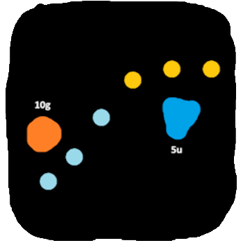
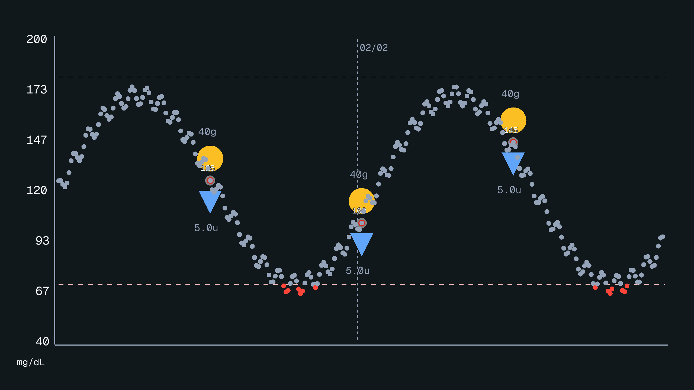
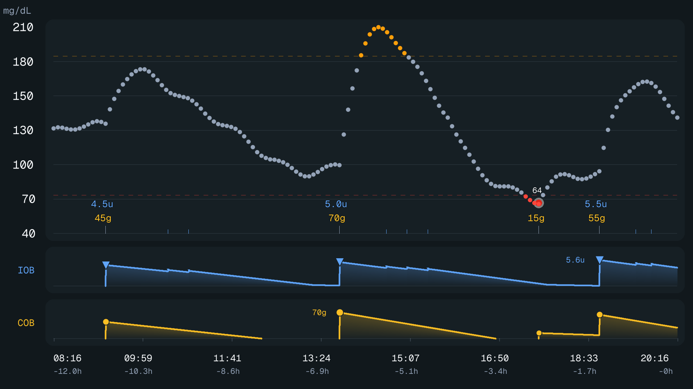
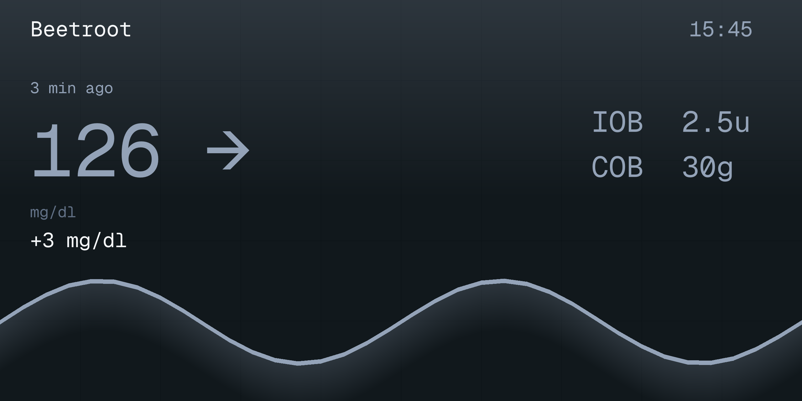
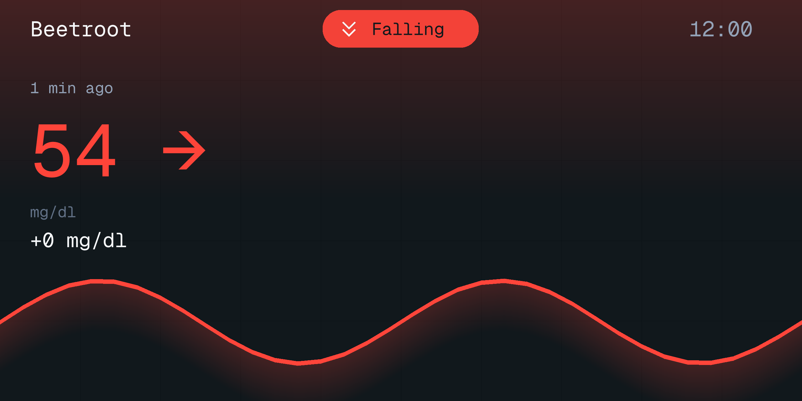
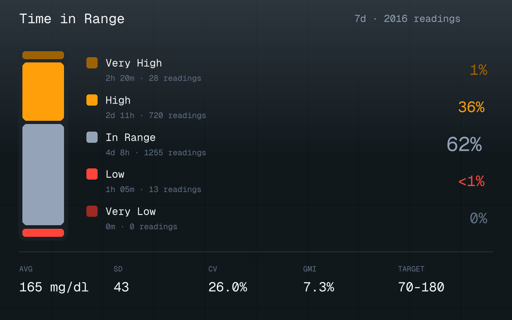
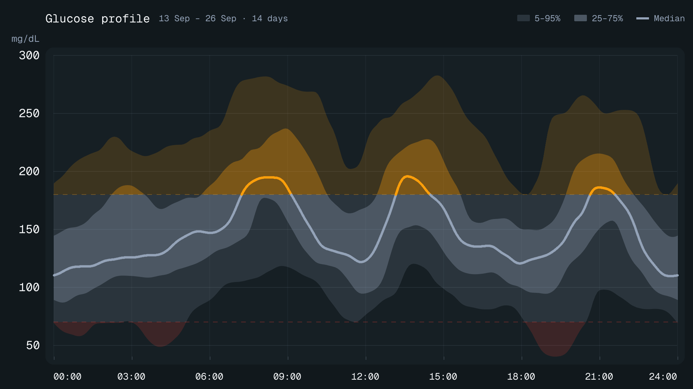
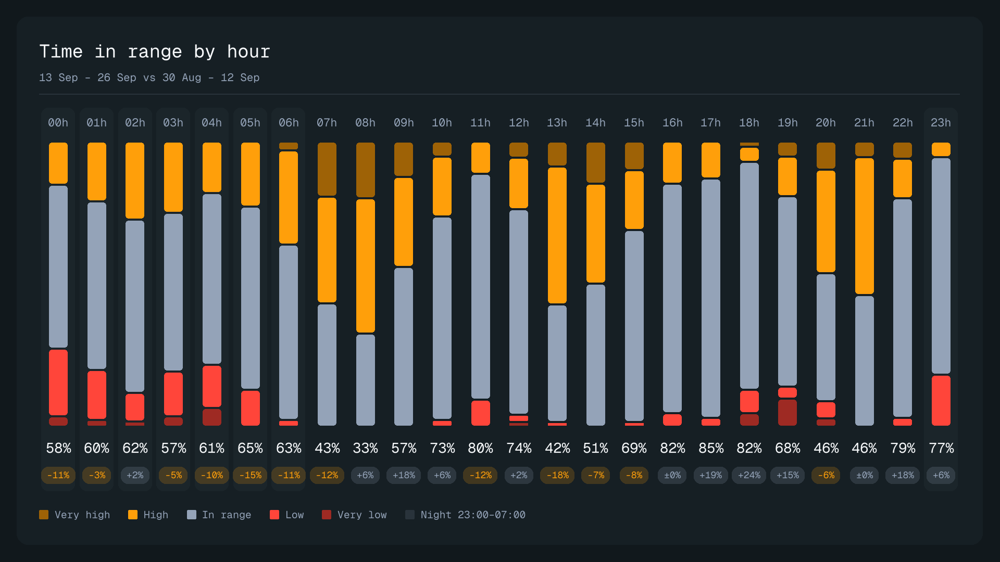
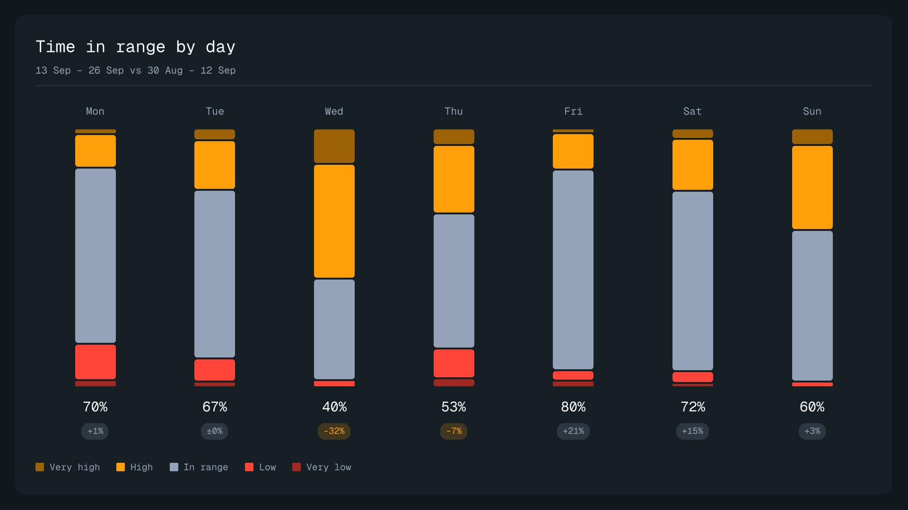
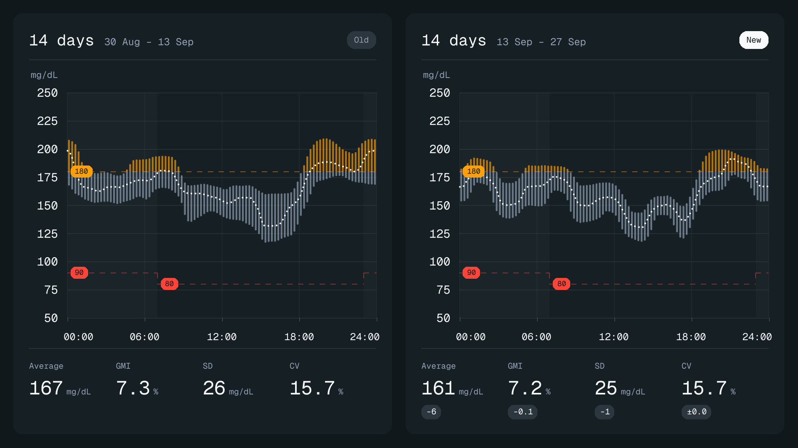

<p align="center">
  
</p>

<h1 align="center">Bonbon</h1>

<p align="center">
A sweet and simple Rust library for generating static diabetes data visualizations.
</p>

---

## Overview

Bonbon is a fast, customizable graph rendering library designed for diabetes related data visualization. It supports glucose entries, insulin doses, carbohydrate intake, and manual blood glucose readings with configurable themes, units, and layout options.

## Features

- **Flexible Units**: Support for mg/dL, mmol/L, or dual-unit display
- **Treatment Visualization**: Insulin boluses, carbohydrate entries, and manual BG readings
- **Customizable Themes**: 6 built-in themes. (See `Theme::builtins()`) with full customization support
- **Dynamic Scaling**: Automatic Y-axis scaling based on glucose values
- **Timezone Support**: Accurate time axis labels for any timezone
- **Microbolus Filtering**: Configurable threshold to simplify SMB visualization
- **Mini Graphs**: Optional insulin and carbs on board graphs under the glucose graph, from your treatments faded over a duration you set, or from your AID system's reported values
- **BG Card**: Compact status card showing current glucose, trend, delta, IOB/COB, and a 3 hour sparkline
- **Percentile Graph**: A typical day summarized from any number of days: the median with 25–75% and 5–95% bands (an Ambulatory Glucose Profile), colored by glucose status
- **Breakdown Graph**: Time in range for each hour of the day or each day of the week, with the change from the previous period
- **Compare Graph**: Two periods side by side, each with its typical day and average, GMI, SD and CV, plus the change between them
- **Time in Range Card**: TIR summary with a stacked band bar, per-band durations and counts, plus average, SD, CV and GMI statistics

---

## Glucose Graph

The Glucose Graph is a full-resolution chart rendering glucose entries over time, with optional treatment markers (insulin boluses, carbs, manual BG readings), configurable Y-axis scaling, timezone-aware time axis, and dual-unit support.

<p align="center">
  
</p>

### Mini graphs

The glucose plot is always drawn. Under it you can stack none, one or several mini graphs, each in its own matching panel sharing the plot's time axis, in the order you add them. Two kinds are available: insulin on board (`MiniGraph::iob`) and carbs on board (`MiniGraph::cob`). Each is a line over a soft gradient area, labelled with its peak value, and every treatment is marked where it lands on the curve: a triangle per insulin dose (microboluses smallest) and a dot per carb entry, sized by amount.

<p align="center">
  
</p>

Give each one a duration: every treatment counts in full when given and fades in a straight line to nothing over that time, and the graph shows the total still on board. Use your duration of insulin action for IOB and your carb absorption time for COB.

```rust
let graph = GlucoseGraphBuilder::new()
    .with_entries(entries)
    .with_treatments(treatments)
    .add_mini_graph(MiniGraph::iob(Duration::hours(4)))
    .add_mini_graph(MiniGraph::cob(Duration::hours(3)))
    .build()?;
```

With an AID system you can pass the values it reports instead (with the `cinnamon` feature, `on_board_from_device_statuses` reads them from Nightscout device statuses):

```rust
let (iob, cob) = on_board_from_device_statuses(&device_statuses);
let graph = GlucoseGraphBuilder::new()
    .with_entries(entries)
    .add_mini_graph(MiniGraph::iob_reported(iob))
    .add_mini_graph(MiniGraph::cob_reported(cob))
    .build()?;
```


---

## BG Card

The BG Card is a compact 640×320 status card (scalable via `with_scale`) that renders current glucose, trend arrow, delta, age, IOB/COB, and a color-coded 3-hour sparkline with an ambient gradient fill.

<p align="center">
  
  
</p>


---

## Time in Range Card

The Time in Range Card is a 640×400 summary (scalable via `with_scale`) of how much time was spent in each glycemic band (very low, low, in range, high, very high) rendered as a stacked bar with per-band percentages, durations and reading counts, and a statistics footer (average, SD, CV, GMI, target range). Band thresholds, units, theme and the 3-band/5-band layout are configurable, and the computed numbers are available without rendering through `TirStats::compute`.

<p align="center">
  
</p>

---

## Percentile Graph

The Percentile Graph shows how glucose typically runs through the day, from readings over any period (14 days is the usual choice). At each time of day it draws the median as a line, the 25th–75th percentile band around it and the lighter 5th–95th band around that, colored by glucose status, over the same framed panel, target lines and axes as the Glucose Graph. Each time slot uses every reading within 30 minutes of it, and the curves are lightly smoothed, as in AGP reports.

<p align="center">
  
</p>

```rust
let graph = PercentileGraphBuilder::new()
    .with_entries(last_14_days)
    .with_targets(70.0, 180.0)
    .with_timezone(chrono_tz::Europe::Paris)
    .build()?;
```

The bands are configurable, e.g. a single 15th–75th band with the median:

```rust
.with_bands(PercentileBands { inner: (15.0, 75.0), outer: None, median: true })
```

`PercentileProfile::compute` returns the numbers without rendering an image.

---

## Breakdown Graph

The Breakdown Graph splits time in range by hour of the day or by day of the week, from the same builder. Each column gets a bar stacked from very low to very high and its time in range, and given the previous period, a chip with how it changed (green-tinted when it went up, orange when it went down). All 24 hours fit in one 16:9 image, and night hours are shaded when night targets are set.

<p align="center">
  
  
</p>

```rust
let by_hour = BreakdownGraphBuilder::new()
    .with_entries(last_14_days)
    .with_previous(previous_14_days)
    .with_grouping(Grouping::Hour) // or Grouping::Weekday
    .with_targets(80.0, 180.0)
    .with_timezone(chrono_tz::Europe::Paris)
    .build()?;
```

---

## Compare Graph

The Compare Graph puts two periods side by side, typically the last 14 days and the 14 before them. Each card shows a typical day, with a bar every 15 minutes spanning the middle half of the readings (25th to 75th percentile) under a dotted median, colored by glucose status, and the period's average glucose, GMI, standard deviation and coefficient of variation. Both cards share one scale, and the second shows how each number changed. Different targets can apply overnight: the target lines step at the night's edges and the night is shaded.

<p align="center">
  
</p>

```rust
let graph = CompareGraphBuilder::new()
    .with_periods(previous_14_days, last_14_days)
    .with_targets(80.0, 180.0)
    .with_night_targets(NightTargets {
        low: 90.0,
        high: 180.0,
        from: NaiveTime::from_hms_opt(23, 0, 0).unwrap(),
        until: NaiveTime::from_hms_opt(7, 0, 0).unwrap(),
    })
    .with_timezone(chrono_tz::Europe::Paris)
    .build()?;
```

---

## Installation

Add Bonbon to your `Cargo.toml`:

```toml
[dependencies]
bonbon = "0.4.1"
```
## Examples & Docs
Some usage examples can be found in the `bonbon/examples` directory.

Additional documentation can be found on the `docs.rs` website.

## Performance Tips

To achieve the best possible rendering speed, it is highly recommended to compile with **native CPU optimizations**. This enables modern SIMD instructions (AVX2, NEON, etc.), which accelerates the pixel blending and sprite rendering operations.

You can enable this by setting the `RUSTFLAGS` environment variable:

```bash
RUSTFLAGS="-C target-cpu=native" cargo build --release
```

Or by adding a `.cargo/config.toml` to your project:

```TOML
[build]
rustflags = ["-C", "target-cpu=native"]
```

## Benchmarks

### BG Card build time at 4× scale (2560×1280)
Averaged across 8 rendering scenarios (InRange, High, Low, multi-status, mmol/L, flat sparkline, single point, no sparkline).

| Hardware | Avg. build time |
| --- | --- |
| **Ryzen 5 9600x** | ~25.3ms |

### Graph build time (using native CPU compilation optimizations)
| Benchmark Test | Resolution | Entries | Ryzen 5 9600x | Quad-core ARM Cortex-A72 |
| --- | --- | --- | --- | --- |
| **Standard FHD** | 1920x1080 | 288 | 2.26ms | 21.15ms |
| **QHD** | 2560x1440 | 288 | 2.95ms | 27.80ms |
| **UHD 4K** | 3840x2160 | 288 | 5.56ms | 59.26ms |
| **Extreme 8K** | 7680x4320 | 288 | 19.66ms | 218.67ms |
| **High Data Volume** | 1920x1080 | 8,640 | 34.62ms | 206.94ms |


## License

This project is licensed under the  MPL-2.0 License. See the [LICENSE](LICENSE) file for details.

This project uses Material Icons by Google, licensed under the Apache License 2.0.
https://github.com/google/material-design-icons